\newpage

<!---

1. open TERMINAL
2. RUN THE FOLLOWING LINE IN THE TERMINAL

pandoc --toc --number-sections External_Server_Guide.md --pdf-engine=xelatex -o External_Server_Guide.pdf

pandoc --toc --number-sections External_Server_Guide.md --pdf-engine=xelatex -V geometry:top=27mm -V geometry:bottom=27mm -V geometry:left=27mm -V geometry:right=27mm -o External_Server_Guide.pdf


ALTERNATIVE

https://marketplace.visualstudio.com/items?itemName=yzane.markdown-pdf

-->

<!---

About BPLIM
=========================

The ability to collect and accumulate microdata has been a powerful
function of central banks. In the scientific community, an increasing
number of research has been conducted using the micro-level
information. To enhance collaborations between the central bank and
the researchers, an advanced data-sharing platform is essential.
Accordingly, the Banco de Portugal Microdata Research Laboratory
(BPLIM) (*Laboratório de Investigação em Microdados do Banco de
Portugal*) is created to facilitate future scientific research effort
that incorporates the use of microdata. By eliminating the data access
barrier, BPLIM aims to inspire researches that effectively utilize the
Portuguese administrative micro datasets and contribute to our
understanding of the economic and financial challenges of our time.

Data Confidentiality
==================================

While researchers prefer unrestricted access to data, care must be
given to secure the confidentiality of the data providers. All the access
granted to microdata should obey the applicable law, and the data
should only be used for research purposes.

Therefore, the data is only made available to the Banco de Portugal's
internal researchers and those approved external researchers who have
agreed to the bank's legal provisions concerning the use of its data.
Specifically, each external researcher is required to sign a
Confidentiality Agreement with the bank and will only be allowed to
access a customized set of data that is tailored to his/her research
needs. All micro data sets made accessible to external researchers
will be anonymized and stored in information systems belonging to
Banco de Portugal (BdP).

The type of access to the Microdata varies according to levels of
confidentiality (low, medium, high).

-   **Low**: information that can be obtained from the public or
    scientific community by other institutions

-   **Medium**: information pertaining to institutions (firms, banks,
    etc.) not included in the previous case (some CB, CRC Firms, Bank
    Balance Sheet Data).

-   **High**: information about individuals or households not included
    in the **Low** case (CRC Individuals).

-->

<!--=========================================== --->

\newpage

# Access to the External Server

## Upon access approval

The User will be able to connect to the external server using `NoMachine` client access: see [Section 8.4](#install_nomachine) for details on installation and use.

<!--- one of two possibilities.
  - Browser access (_low performance_): see [Section 8.4](#browser_access) for further details
-->


## Password policy
  - The first password delivered must be changed at the first login.
  - After **60 days** the password will expire: the login window will show `new password`
  - The passwords to be specified must meet the requirements described in [Section 8.3](#password).

## First steps

Once you start `NoMachine`, these are the first three screens you will see:

::: center
{width=65%}
:::

{width=65%}

{width=65%}

4. Select the "**Kickoff Application Launcher**" menu (in the lower left corner):

{width=10%}

{width=50%}

5.  Then you should:
  - Click on the "**Applications**" button
  - Select **"BPLIM"** and click on your project (i.e., "pxxx\_name"). At this stage, you should see a graphical environment ('Dolphin' application[^1]) like this:

{width="4.724409448818897in"
height="2.808662510936133in"}

You can see the prompt command line together with 'Dolphin' using the
keyboard shortcut 'F4'.

> c. Files with the \"**sh**\" extension allow you to send
    commands to your operating system or to enter your operating
    system for interactive use (for example, the file `stata_container.sh` will launch the graphical version of Stata). You can start the
    application by double-clicking
    the file name in 'Dolphin'[^2] or by typing in the Terminal `./stata_container.sh`

6. The directories that you have access to within the folder include:

+-----------------------------------+-----------------------------------+
| **initial\_dataset**              |                                   |
|                                   | Data sources provided by BPLIM.   |
|                                   |                                   |
|                                   | *You have                         |
|                                   | read-only access to this          |
|                                   | directory.*                       |
+-----------------------------------+-----------------------------------+
| **initial\_dataset/modified**     |                                   |
|                                   | Modified data provided by BPLIM.  |
|                                   |                                   |
+-----------------------------------+-----------------------------------+
| **results**                       |                                   |
|                                   | Output files that                 |
|                                   | researchers wish to generate      |
|                                   | and extract from the server.      |
|                                   |                                   |
|                                   | *You                              |
|                                   | have read-write access to this    |
|                                   | directory.*                       |
+-----------------------------------+-----------------------------------+
| **tools**                         |                                   |
|                                   | Specific analysis tools.          |
|                                   |                                   |
|                                   | *You have read-only access to     |
|                                   | this directory.*                  |
+-----------------------------------+-----------------------------------+
| **work\_area**                    |                                   |
|                                   | Temporary                         |
|                                   | work directory.                   |
|                                   |                                   |
|                                   | *You have read-write              |
|                                   | access to this directory.*        |
+-----------------------------------+-----------------------------------+
| **/bplimext/doc/Manuals**         | Manuals and auxiliary files       |
|                                   | are available here.               |
+-----------------------------------+-----------------------------------+

  - You will have in your **work\_area** folder templates for both Stata and R(`R.sh`). By default, the template file is read-only.

7. To reset and disconnect the remote desktop connection or session,
    you can simply log out of your remote session, as shown in the screenshot below. After you log out, close the window.[^3]

{width="3.1496062992125986in"
height="3.505206692913386in"}

Confirm before exiting by clicking on the **"Logout"** button to close the window:[^4]

{width="1.1423611111111112in"
height="0.5228762029746282in"}

  - In case you do not logout, your session will be left open until your
    next login. You may use this facility to run your programs. However,
    one must be aware that this option uses resources from the server,
    so the efficient solution to run your programs "overnight" is using
    the batch mode as described in Step 6 below. Furthermore, in case
    the server is rebooted during a maintenance procedure, your session
    will be automatically closed, and unsaved documents will be lost. We
    recommend you save at regular intervals your statistical programs.


\pagebreak
# Important guidelines

## Keep your home area tidy

 - _Do not save files in your home area_ `/home/USER_LOGIN`. _In case you exceed its size you will not be able to login._

 - Check regularly the size of your project on the harddrive. Open a Terminal and apply the following steps:

  1. Move to the project folder: `cd /bplimext/projects/p000_xxx_yyy/`
  2. List project size: `du -h`
  3. Check size by folder and list folders with at least 1Gb: `du --max-depth 1 -h | sort -n | grep G`
  4. Move to the folder 'work_area': `cd work_area`
  5. Repeat the check in this folder: `du --max-depth 1 -h | sort -n | grep G`
  6. Identify duplicated and temporary files and delete them: use the command `rm`
  7. Compress big files/folders you are not using at the moment:
  
  > Compress folders: `tar -zcvf YOUR_FOLDER.tar.gz YOUR_FOLDER`
  >
  > Compress individual files: `gzip YOUR_FILE`


## Using the Terminal

Linux's Terminal is a command-line interpreter. You can use the 'shell' for a wide range of tasks, including searching files and files' contents, organizing your working space, and, most importantly, running your programs in `batch` mode.

1.  Linux's Terminal can be accessed from[^5]

RedHat \> Applications \> System \> Terminal

{width="3.937007874015748in"
height="1.848682195975503in"}

2.  See [Section 8.1](#shell_commands) for a list of some of the most used commands.

3. If you use a non-English keyboard, the 'true' keyboard
    might be different from the one you see. The changes apply mostly
    to the symbols, not letters or numbers. For example, in case you
    have a Portuguese keyboard on your computer the '+' is now in key
    '?', or the '\*' is in SHIFT + ?. This issue is specific to the
    Operating System of your computer

4. Remember that Linux is case-sensitive: e.g., "`LS`" and "`ls`" are
    treated as different commands.

5. You can use the arrow keys to scroll up and down through the
    commands you have entered.

6. You can use the "Tab" key to complete the command line
    automatically.

7. _e.g._, type the following line to list elements within a folder in a 'human-readable' format, `h`, long list format, `l`, in reverse order,
    `r`, sort by modification time, `t`, and almost all files, `A`,

    `ls -lArth`

# Statistical software{#statistical_software}

The installation of additional commands/packages must be requested from the BPLIM team, bplim@bportugal.pt. Researchers are not allowed to install new commands/packages on the server autonomously.

## Stata

Stata versions available on the server: **15 to 19.5 (Stata Now)**. Below are the options for running Stata depending on your project setup.

### Running Stata within a container

For projects configured with a container, Stata runs inside that environment. In this case, you will find a file named **`stata_container.sh`** in the project’s folder. You can start Stata in any of the following ways:  

- **Using the file manager**: double-click the `stata_container.sh` file to launch Stata.  
- **Using the Terminal**:  
  1. Open a Terminal in the project’s folder.  
  2. Execute:  
     ```bash
     ./stata_container.sh
     ```  
- **Directly opening the container** (advanced):  
  ```bash
  singularity shell tools/_container/CONTAINER_ID.sif
  ```
and type

  ```bash
  xstata-mp
  ```

  If your project does **not** currently use a container and you would like to upgrade to the latest version of Stata, please contact the BPLIM Team.

### Running native (installed localy) Stata versions

For accessing the native Stata installations (versions 15 to 18), follow the instructions below.


2.1 Stata can be accessed in interactive graphical or non-graphical
        modes.[^6]

  - Interactive non-graphical mode

    Move to the desired folder, e.g.,

      `cd /bplimext/projects/I001_jdoe/`

    and type

      `stata17-mp`

{width="3.543307086614173in"
height="2.488604549431321in"}

  - You may add a 'PATH' to your system folder by typing, for example on Stata 16, the following command in the shell "vi ~/.bash_profile" and adapt the following line
    
    `PATH=$PATH:$HOME/.local/bin:$HOME/bin:/opt/bplimext/stata17`

  - For the interactive graphical mode click on the icons
    "**xstata17mp.sh**" (Stata 17) located in the
    'desktop', depending on the desired Stata version,

{width="0.5905511811023622in"
height="0.46653543307086615in"}

{width="3.937007874015748in"
height="2.486382327209099in"}

  - You can use the 'Do-file Editor' in Stata to create your own
      "do-files" and "ado-files", or you can use
      *KWrite* editor (or 'gedit')

  - You can open it from **RedHat** \> **Applications**
      \> **Utilities** \> **KWrite**. You can also launch 'KWrite' from the 'shell' by typing 'kwrite'

  - In case the Stata's icon is not on your desktop, use Dolphin, move to the folder
    '/bplimext/scripts/wrappers/', and drag and drop the file 'xstata17-mp' into
    the desktop

{width="3.937007874015748in"
height="2.486382327209099in"}

**NOTE**: to start Stata use the shortcuts in your project's folder.

2. To look for **"ado-files"**:

"Ado-files" are text files containing the Stata program. It is
advisable that one create and save his/her "ado-files" so the results
can be replicated later by running the saved "ado-files" on the
BPLIM's datasets.

Stata looks for "ado-files" in several places. When it comes to
personal ado-directories, they can be categorized in four ways:

  - (SITE), the directory for "ado-files" your site might have
    installed;

  - (PLUS), the directory for "ado-files" you might have
    installed;

  - (PERSONAL), the directory for "ado-files" you might have written;

  - (OLDPLACE), the directory where Stata users used to save their
    personally written ado-files.

The ado-files you have just written or those created for this project
can be found in the current directory (.).

 Specific 'ado-files' you may ask to be made available in the server
 will be placed in your folder
 '/bplimext/projects/YOURPROJECTID/tools'. You should add this folder
 to your Stata 'ado-files' folder by executing the following command
 within Stata,

  `sysdir set PERSONAL "/bplimext/projects/YOURPROJECTID/tools"`

 You may also edit your 'profile.do' file, located in your root folder,
 "/home/YOURPROJECTID/", and add key instructions you may want to be
 executed every time you start Stata. The above instruction is one of
 such cases. You can create or edit the file 'profile.do' using
 'Do-file Editor' within Stata ('vi profile.do' or KWrite are also a
 possibility).

 The ***sysdir*** command within Stata will tell you where they are on
 your computer:

{width="3.9368055555555554in"
height="2.2751399825021874in"}

<!---
3. Stata's temporary files:

> Check the location of the folder with temporary files

- In the command line in Stata type the following two commands to check the location of your temporary folder (`tempfile`):

> `tempfile junk`

> `display "``junk'"`

> In the work_area of your project add a folder named `.TMP`

> Using the Terminal, go to your home folder, `cd ~`, and the file `.bashrc` (e.g., with `kwrite` or `vim`) and add the following lines:

> `STATATMP="/bplimext/projects/YOUR_PROJECT_ID/work_area/.TMP"`

> `export STATATMP`

> In the Terminal type `source .bashrc`

> In the Linux Taskbar click in the RedHat and choose Logout

> Re-start your NoMachine session

> Start Stata and confirm that your `tempfile` folder is pointing to the folder `.TMP`

## 'batch' mode: an example using Stata
-->

1.  Start a *\'**shell**\'* in Linux and navigate to the directory
         of the "do-file" file that you want to run (ex: prog1.do)

`cd /bplimext/projects/I001_jdoe/work_area/`

2. You might find it easier to use 'Dolphin' (= File Manager) to move
     over your folder structure. In this case, we recommend activating
     the 'shell' (= 'Terminal') associated with 'Dolphin'

  -  use Dolphin/File Manager

  - click 'F4' to activate the shell with Dolphin. Benefit: fast
         transition within folders and, at the same time, the ability
         to run shell commands

3. Create an ASCII file named, e.g., 'batch\_prog1'

4. Inside the file, write just a line with the execution command you
     would type in the 'shell'; e.g.,

    `/bplimext/projects/I001_jdoe/stata-mp do`
    
    `/bplimext/projects/I001_jdoe/work_area/prog1.do`

5. You can use, for example, the command line app 'vi' to create the batch file

{width="3.543307086614173in"
height="0.8180216535433071in"}

6. The batch file can also be created using apps like 'kwrite' or Stata
     'do file editor'

{width="3.543307086614173in"
height="1.1132370953630797in"}

or

{width="3.543307086614173in"
height="2.0134241032370954in"}

7. You may add the extension '.txt' to the name of the batch file, as
     sometimes Stata *doeditor* does not 'see' the file 'batch', while
     it 'sees' 'batch.txt'

8. Once the batch file is created, one runs the `.do` file in batch mode
     by typing in the 'Terminal':

    `at now -f batch.txt`

9. Type 'man at' to see a further option of the command '`at`'; e.g., one
     could type

    `at now + 5 hours -f batch.txt`

  or

    `at now + 4 minutes -f batch_prog1`

  to run the Stata program within 5 hours or 4 minutes from now,
  respectively. '`man`' is the help function in Linux

10. Type '`top`' in the shell/Terminal to confirm the program is running

11. Under '`top`' type '`i`' to hide irrelevant processes (show less output)

12. To kill a running process with '`top`' press '`k`', for '`kill`', write
    > the process number and then type '`9`'. The process number is
    > identified in the first column as PID

13. To get out of the `top`, type '`q`'

14. Useful features of the command '`at`':

  - '`atq`': use it to see programs in the batch queue (an '`=`' sign
         indicates the program is running; an '`a`' indicates it is in
         the queue and we see the time when it will be executed)

  - '`atrm` \#': remove a batch from the batch queue

  - one can see how the batch is running by typing

      `tail --f logcrc_may21.log`

 It allows you to see an updated version of the last lines of the log;
 *i.e.*, it updates each time Stata changes the log. A key
 advantage of `tail` is that it does not interfere with the log file. Namely, it does not write over it.

15. Another way to run a program in the background is by using the
     command '`screen`'

  - '`screen`' is useful when one wants to run Stata in interactive
         mode and still guarantees that if the network connection goes
         down one does not lose the session. We can simply kill the
         'NoMachine' session and recover it later by typing '`screen --r`'

  - We can run several instances of `screen`. If this is the case,
         after opening a new NoMachine session, we need to type in the
         Terminal shell '`screen -d`' to identify the running background
         sessions. We can retrieve a particular session by knowing the
         '`pid`' number and typing '`screen -r 34176`'


## R

1. As with Stata, R can be accessed in interactive graphical or non-graphical modes.

  - Interactive non-graphical mode: go to the RedHat symbol and type `R' in the Search box

{width=50%}
    
  - Alternatively, you can open a Terminal and type

> `R`

  - Please make sure R is in your PATH; type `$PATH` in the Terminal. If this is not the case, type `PATH=$PATH:/usr/bin/`

2. Using RStudio.

  - Open a Terminal and type 
  
  > `rstudio`

  - Please make sure RStudio is in your PATH; type $PATH in the Terminal. If this is not the case, type
  
  > `PATH=$PATH:/opt/bplimext/R/usr/lib64/rstudio/bin/`

  - In case you face difficulties opening/saving files in RStudio, please open a Terminal and type

  > `/bplimext/scripts/wrappers/R.sh`

**IMPORTANT**: do not save your workspace image in your home folder (`Save workspace image? [y/n/c]`). If you want to keep the workspace file save it in your project folder under `work_area`. 

**RStudio Font Type**: please make sure you are not using Font Type Courier (Menu Tools, Global Options, Appearance ...)

## Python

1. Open a Terminal and type

> `python3`


## Julia

### Alternative A

1. Open a Terminal and type (`julia` is located in /opt/bplimext/julia/lib/, you can add it to your `PATH`)

> `julia`

2. Use Atom: open a Terminal and type

> `atom`

### Alternative B: using a container (see the discussion in the Appendix)

1. Request a container with **`Julia`** for your project

> The container will be in the folder `tools\_container` inside the project folder

> **Advantages**: you can build a Julia setup fine-tuned to your project, including the definition of Julia's version and packages


## Updates to the commands and packages list

  Additional commands/packages or updates to the existing ones have to be requested from BPLIM's Team.

## Build a container to fine-tune your statistical packages

  You can use Singularity containers in the server. To do so, please send us the definition file so we build the image and put it in your working area.
  You can find detailed information on Singularity containers at [https://sylabs.io/](https://sylabs.io/).[^8] We provide some notes in the Appendix.


# Allowed outputs

Stata results can be exported to a file on disk using one of the following formats:

1. ASCII files: e.g., log files

2. graphs: as `.PNG` (do not use the option save, or saving, within a
    graph command; instead, use the separate command line 'graph export xyz.png')

3. csv: CSV (Comma Separated Value format), _e.g._, for use with MS Excel

4. rtf: Rich Text Format for use with word processors

5. xls or xlsx: Excel files with output tables

6. tex: \LaTeX format


# Removing outputs

The output files, e.g., log files or images, must be requested from the BPLIM team, bplim@bportugal.pt. Researchers are not allowed to place or remove files on the server autonomously.

 Place in the "[results]{.underline}" folder all the outputs you want
 to remove from the server.[^7]

1. Send an email with the title
    "**project I001\_jdoe**: request for result extraction" to
    "**[bplim\@bportugal.pt]{.underline}**".

2. Upon validation, the results will be sent to you via email.


# User's Home folder


1. Do not save files in your Home folder:
    "/home/USER_ID/".

2. Regularly clean your Trash folder. If your disk use goes over the quota, you will be prevented from login in. In the Terminal type:
    
    `rm -rf ~/.local/share/Trash/*`


# Scientific support

Researchers will be provided with the necessary scientific and
computational support (*i.e.*, advises on programming, computational
resources, micro econometrics, and econometrics of panel data for
research undertaken with the selected microdata).


# Project Archival Policy

Projects that remain inactive for more than two (2) years will be archived. Archived projects will no longer be available and can be reactivated upon request.


# Appendix

## Basic 'shell' commands on Linux{#shell_commands}

-   `top`: List the procedures that are being executed on the
    server

    -   press '`i`' option to omit background processes;

    -   clicar press '`h`' para ***help on top options*** ; '`h`'
        > option to obtain the **top command help**.

-   `pwd`: Show current working
    directory

-   `cd`: Change directory

    `cd /bplimext/projects/I001_jdoe/work_area/`

    '`cd ~`' moves to your home folder

<!-- -->

-   `cp`: Copy file(s) to a given path

    `cp prog1.do /bplimext/projects/I001_jdoe/results`

<!-- -->

-   `mv`: Move file(s) or rename a file from a given path

    `mv prog1.do /bplimext/projects/I001_jdoe/results`

<!-- -->

-   `rm`: Delete a file

    `rm /bplimext/projects/I001_jdoe/results/prog1.do`

<!-- -->

-   `mkdir`: Creates a directory

    `mkdir programs`

<!-- -->

-   `rmdir`: Deletes a directory

    `rmdir programs`

<!-- -->

-   `screen`: Switch between screen

    `screen top`

<!-- -->

-   `man`: Show the manual page for the given command

    `man ls`

<!-- -->

-   `du -h`: Check the information on disk usage of files and
    directories.

> The "`-h`" option with "`du`" command provides results in "Human
> Readable Format".

Ex: `du /bplimext/projects/I001_jdoe/work_area/`

-   `df -h`: Check disk space utilization and show the disk space
    > statistics in "human readable" format.

-   `vi`: View 'ASCII' files; e.g., log files

-   `ghostscript`: Preview files with the extensions of _.eps_ and
    _.pdf_

> `ghostscript /bplimext/projects/I001_jdoe/results/file_name.pdf`

-   `okular`: View 'PDF'

-   `find`: Find files

> Structure: find /path option filename
>
> `find . -name "*.do"`
>
> Send the '`find`' output to a file:
>
> `find . -name "\*.do" > find_results.txt`
>
> Look for a particular string within the 'find' output:
>
> `find . -name "\*.do" | grep "analysis"`
>
> Identify files with extension '.do' that **contain** the word 'graph':
>
> `find . -name "\*.do" -exec grep "graph export" '{}' \; -print`

-   `passwd`: Change your password

-   **To exit** a program, type **CTRL + C** ('CTRL + C' kills a particular
    execution in the shell)


## Using the 'vi' file editor

1.  In the shell type '`vi batch1.txt`'

2.  These are the main shortcut keys

    a.  'i' insert text

    b.  'ESC' key get out of the 'insert' mode

    c.  'x' delete specific characters

    d.  'dd' delete a full line

    e.  '10 dd' delete 10 lines

    f.  'yy' copy lines

    g.  'p' paste lines

    h.  'SHIFT + G' go to the last line

    i.  'gg' goes to the first line

    j.  'ESC + q!' exit 'vi' without writing

    k.  'w!' write and replace the file

    l.  'ESC + q' exit the 'vi' session

    m.  Check, for example,
        [https://www.cs.colostate.edu/helpdocs/vi.html](https://www.cs.colostate.edu/helpdocs/vi.html)

3.  Much easier solution: call '`gedit`' file editor

4.  Linux commands I have to add to the manual

5.  'CTRL + R': allows me to recover a previous command

6.  `vi .bash_history`

## External server's password requirements{#password}

+-----------------------+-----------------------+-----------------------+
| **Rule**              | **Value**             | **Notes **            |
+-----------------------+-----------------------+-----------------------+
| Maximum Password      | **[60                 | *After 60 days the    |
| Lifetime              | days]{.underline}**   | password will         |
|                       |                       | expire*               |
|                       |                       | and has to be changed |
|                       |                       | in the next login.    |
|                       |                       | The password can be   |
|                       |                       | changed at any moment |
|                       |                       | using: **(1)**,"Redhat|
|                       |                       | icon \| Applications  |
|                       |                       | \|Settings \| System  |
|                       |                       | Settings -- Account   |
|                       |                       | Details", click       |
|                       |                       | "Change Password";    |
|                       |                       | or, **(2)**, in the   |
|                       |                       | 'Shell' type 'passwd' |
+-----------------------+-----------------------+-----------------------+
| Minimum Number of     | 4                     | You should include at |
| Character Classes     |                       | least 4 classes of    |
|                       |                       | characters in the     |
|                       |                       | password. For         |
|                       |                       | example, small        |
|                       |                       | letters, capital      |
|                       |                       | letters, numbers and  |
|                       |                       | punctuation marks.    |
|                       |                       |                       |
|                       |                       | There are a total of  |
|                       |                       | five classes:         |
|                       |                       |                       |
|                       |                       | > 1\. Capital letters |
|                       |                       | :                     |
|                       |                       | > A-Z                 |
|                       |                       | >                     |
|                       |                       | > 2\. Small letters:  |
|                       |                       | > a-z                 |
|                       |                       | >                     |
|                       |                       | > 3\. Numbers: 1-9    |
|                       |                       | >                     |
+-----------------------+-----------------------+-----------------------+
|                       |                       | > 4\. Punctuation     |
|                       |                       | > marks: \<space\> !  |
|                       |                       | > % & ( ) \* + . , {  |
|                       |                       | > } \[ \] \~ \" \# \$ |
|                       |                       | > \' - / \\ \^ \_ \`  |
|                       |                       | > \|                  |
|                       |                       | >                     |
|                       |                       | > 5\. Characters above|
|                       |                       | > 127 (0x7F): marked  |
|                       |                       | > characters (ã, á,   |
|                       |                       | > ä, à, etc.);        |
|                       |                       | > symbols (@, £, §,   |
|                       |                       | > º, ª, «, », etc.)   |
|                       |                       |                       |
|                       |                       | Number of characters: |
|                       |                       | by using the same     |
|                       |                       | character 3 or more   |
|                       |                       | times may imply the   |
|                       |                       | use of an additional  |
|                       |                       | class (it is highly   |
|                       |                       | recommended that you  |
|                       |                       | do not use            |
|                       |                       | consecutively the     |
|                       |                       | same character more   |
|                       |                       | than 2 times)         |
+-----------------------+-----------------------+-----------------------+
| Minimum Length of     | 8                     | The minimum size of   |
| Password              |                       | the password is 8     |
|                       |                       | characters (it may be |
|                       |                       | higher in case you    |
|                       |                       | repeat characters)    |
+-----------------------+-----------------------+-----------------------+
| Password History      | 7                     | One cannot use a      |
|                       |                       | password defined in   |
|                       |                       | the previous set of 7 |
|                       |                       | passwords             |
+-----------------------+-----------------------+-----------------------+
| Maximum Consecutive   | 6                     | If the user fails 6   |
| Failures              |                       | consecutive times the |
|                       |                       | password the account  |
|                       |                       | will be locked for    |
|                       |                       | the time defined in   |
|                       |                       | "Lockout Time"        |
+-----------------------+-----------------------+-----------------------+
| Fail Interval         | 60 sec.               | Time interval for     |
|                       |                       | attempts to enter a   |
|                       |                       | password to be        |
|                       |                       | considered            |
|                       |                       | consecutive. If more  |
|                       |                       | than 60 seconds have  |
|                       |                       | elapsed since the     |
|                       |                       | last attempt,         |
|                       |                       | consecutive attempts  |
|                       |                       | are no longer         |
|                       |                       | considered, ie the    |
|                       |                       | number of failures,   |
|                       |                       | according to the      |
|                       |                       | requirement \"Maximum |
|                       |                       | Consecutive           |
|                       |                       | Failures\" becomes    |
|                       |                       | one.                  |
+-----------------------+-----------------------+-----------------------+
| Lockout Time          | 600 sec.              | Time (10 minutes)     |
|                       |                       | during which the      |
|                       |                       | account will be       |
|                       |                       | locked if the maximum |
|                       |                       | number of failed      |
|                       |                       | attempts is reached.  |
+-----------------------+-----------------------+-----------------------+

\newpage

## Download, install and configure NoMachine client{#install_nomachine}

>

**Step 1**: Go to the following link and use the credentials provided by BPLIM to access the site:

>

> [https://www.bportugal.pt/webdrive/index.php/s/irAzxZmir8KHyzD/authenticate](https://www.bportugal.pt/webdrive/index.php/s/irAzxZmir8KHyzD/authenticate)

>

> **Note**: sometimes the internet provider,*e.g.*, a University, may block access to this particular website.
Please check with your provider in case you get an error while trying to use the link.

>

> {width="3.052795275590551in" height="2.3622047244094486in"}

>

**Step 2**: Download the file with an extension compatible with your OS (Operating System).

>

> {width="3.6681966316710413in" height="2.3622047244094486in"}

>

\newpage

**Step 3**: Install 'NoMachine'.

>

> 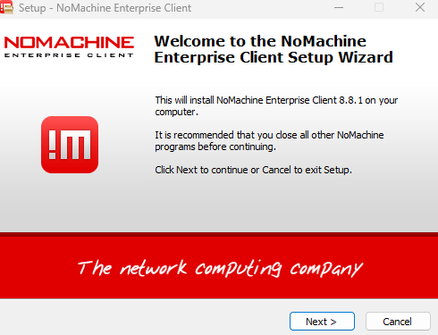{width="4.079410542432196in" height="3.1496062992125986in"}

**\
**

> 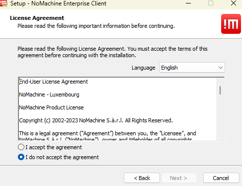{width="4.063740157480315in" height="3.1496062992125986in"}

>

> 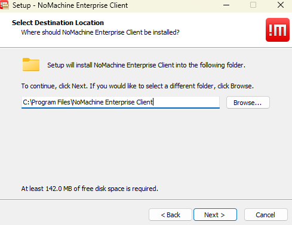{width="4.093652668416448in"
height="3.1496062992125986in"}

**\
**

> 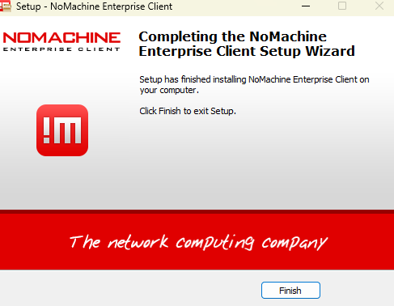{width="4.091154855643045in" height="3.1496062992125986in"}

\newpage

**Step 4**: Reboot your computer

>

> 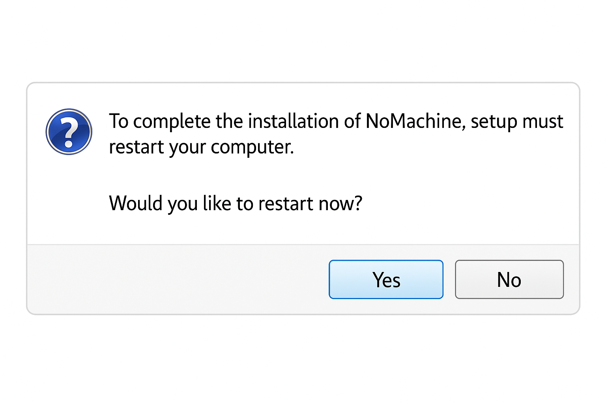{width="2.7559055118110236in" height="1.2160203412073491in"}

**\
**

**Step 5**: NoMachine client access configuration.

>

> **Step 5.1**: Start 'NoMachine' and create a new connection.

>

> 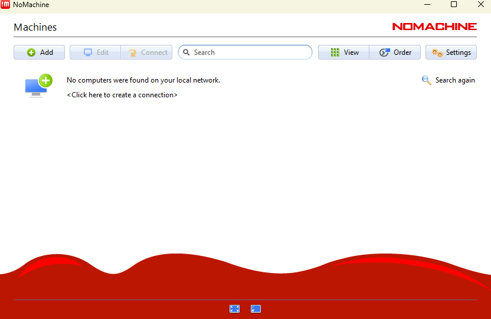{width="4.724409448818897in" height="3.0297101924759406in"}

**\
**

> {width="4.724409448818897in" height="3.0301957567804023in"}

**\
**

> **Step 5.2**: Define the 'Host' as bplimexterno.bportugal.pt, 'Port' 4000, 'Protocol' NX and set a 'Friendly Name' for 'Name'.

>

> 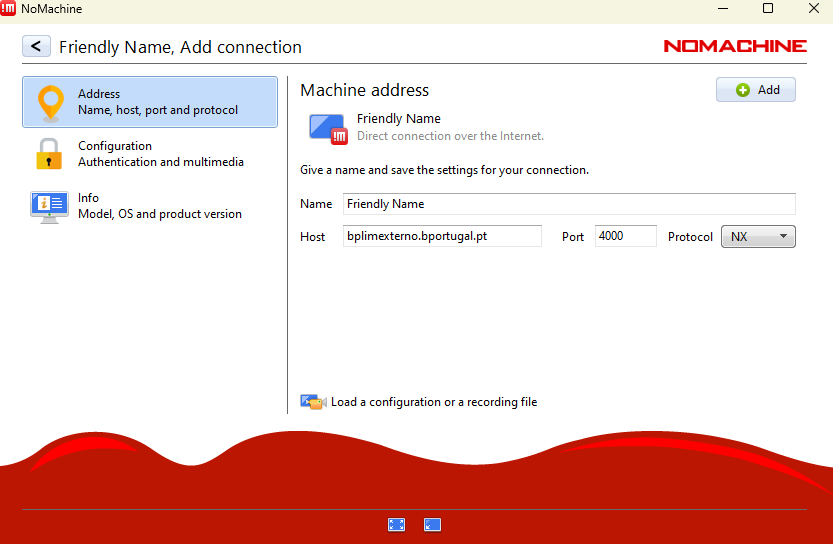{width="4.724409448818897in" height="3.0200164041994753in"}

>

\newpage

> **Step 5.3**: Use password authentication, with or without proxy, depending on the instructions of the network administrator/user \'s
computer support. Click 'Add' to create the connection.

>

> 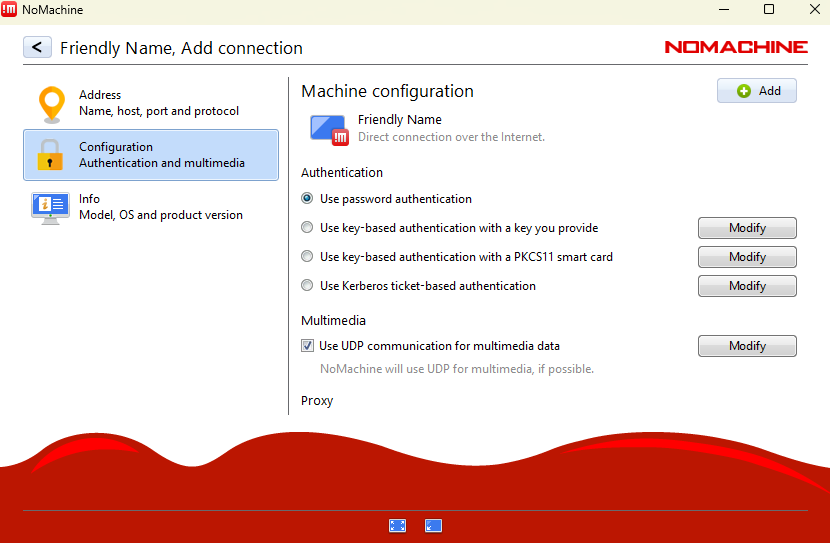{width="4.724409448818897in" height="3.024378827646544in"}

**\
**

> **Step 5.4**: Once the entry for `bplimexterno.bportugal.pt` has been created, connect:

>

> 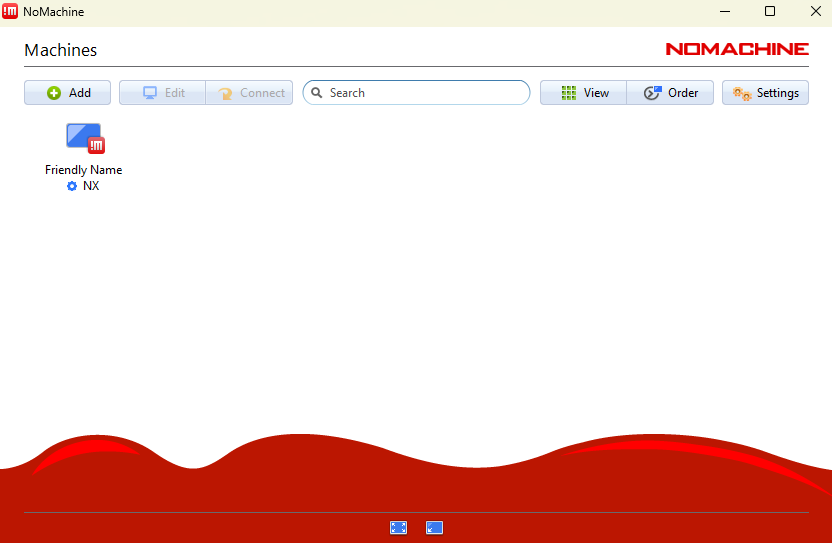{width="4.724409448818897in" height="3.036981627296588in"}

\newpage

> **Step 5.5**: Before the first effective connection, it may be necessary to accept the certificate from bplimexterno.bportugal.pt. You should verify that the \"fingerprint\" (verification code) is:

>

> **SHA256 ED 1B D9 E2 C2 F8 C6 08 1A 53 5F 97 DA 71 77 D9 D2 EE 7A 5F 9C 35 87 B3 19 F4 7E A1 CB 2C 68 0B**

>

> {width="4.724409448818897in" height="2.985113735783027in"}

**\
**

> **Step 5.6**: Connect with the UserID (**case sensitive**) and password provided by Banco de Portugal:

>

> 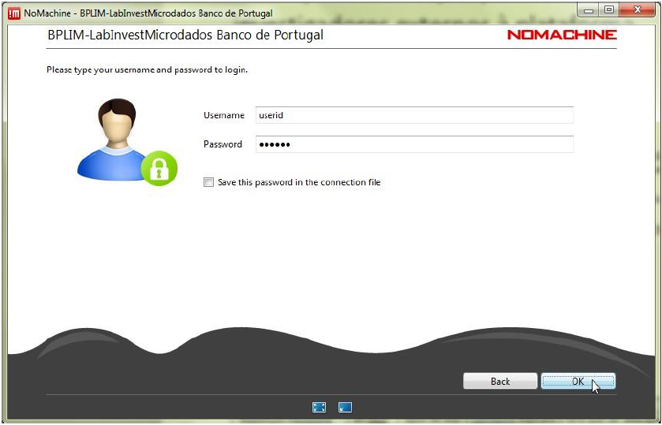{width="4.724409448818897in" height="3.0350426509186352in"}

\newpage

> **Step 5.7**: After the first successful login, it is necessary to change the password, which must comply with the Password Policy defined above.

>

> 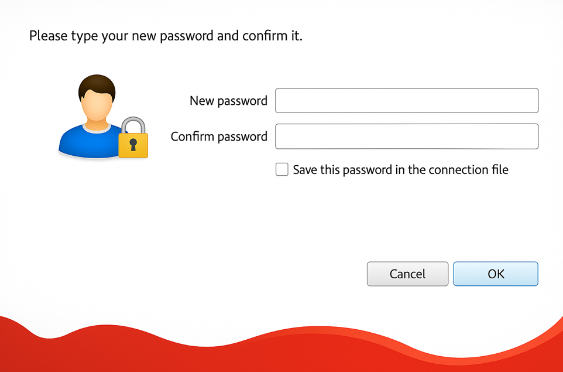{width="4.724409448818897in" height="3.029721128608924in"}

>

> If the new password does not comply with the Password Policy, the original password provided by the Banco de Portugal will be re-requested. You get the message "Authentication failed, please try again." See Appendix 3 for details.

>

> 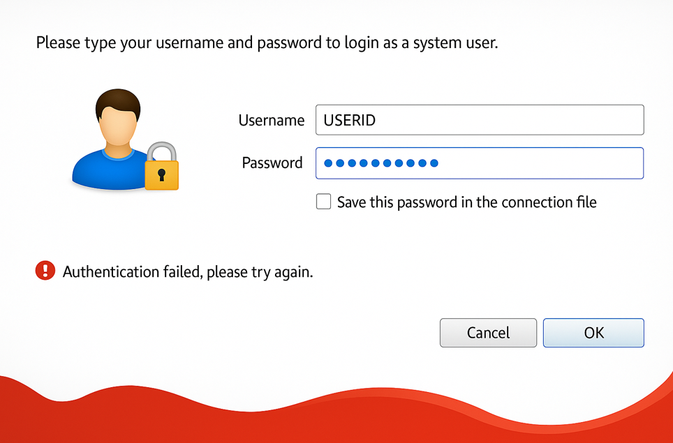{width="4.724409448818897in" height="3.029721128608924in"}

> The NoMachine client does not tell you why the new password was not accepted -- it is the responsibility of the user to verify that the new password is in compliance.

>

\newpage

> **Step 5.8**: Upon login success, the following screens should appear.

>

> {width="4.724409448818897in" height="3.0297101924759406in"}

>

> Create a new desktop.

>

> 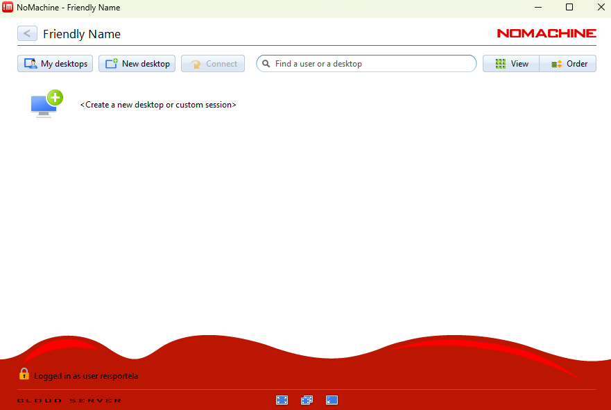{width="4.724409448818897in" height="3.0297101924759406in"}

\newpage

> **Step 5.9**: In the following screend define the settings of your monitor.

>

> 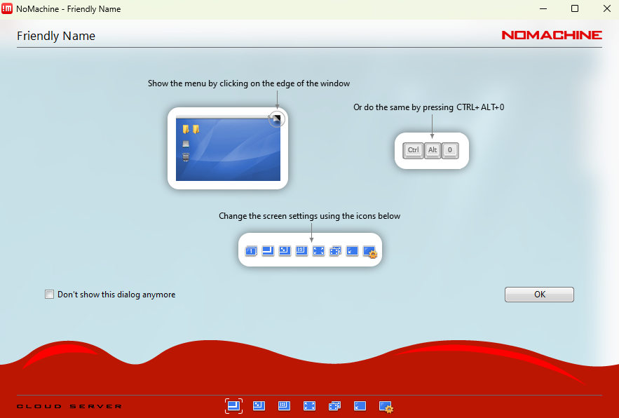{width="4.724409448818897in" height="3.0297101924759406in"}

**\
**

> 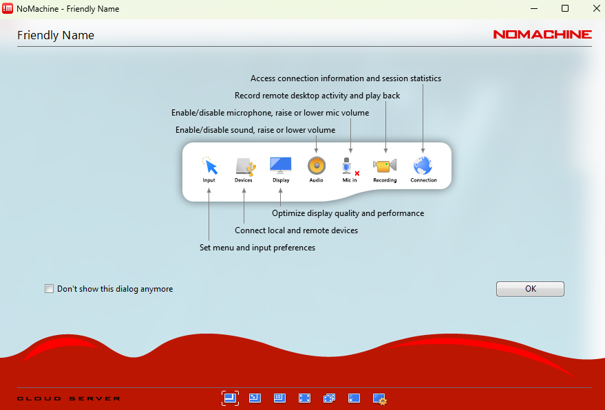{width="4.724409448818897in" height="3.0297101924759406in"}

>

> 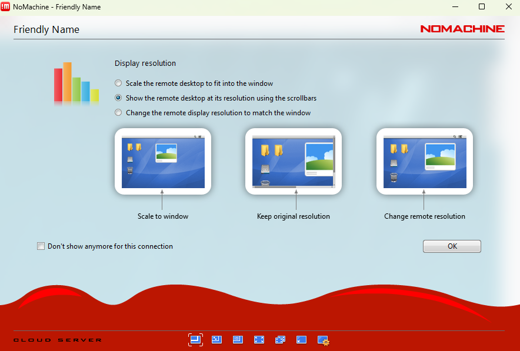{width="4.724409448818897in" height="3.0297101924759406in"}

**\
**

> 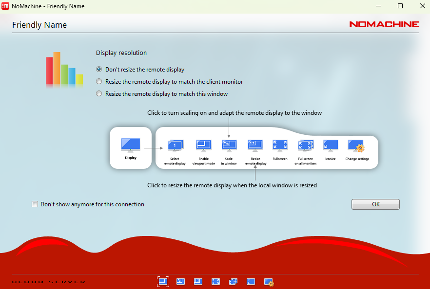{width="4.724409448818897in" height="3.0297101924759406in"}

\newpage

> **Step 5.10**: Upon login success, the following screens should appear.

>

> Once logged in and with access to a KDE session, click on the upper right corner of the KDE desktop, as shown below, to access the menu and then expand the screen as exemplified for greater ease of use.

>

> 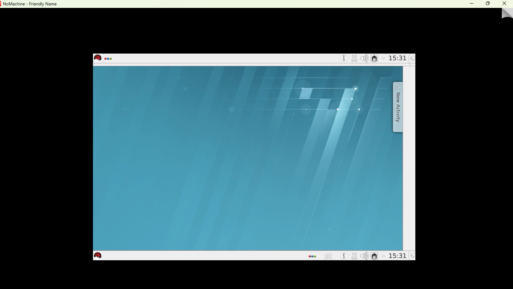{width="4.724409448818897in" height="3.0127438757655294in"}

**\
**

> **Step 5.11**: You should see the following screen.

>

> 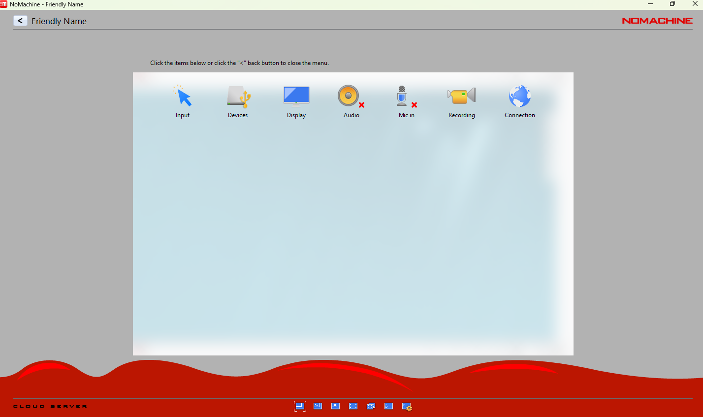{width="4.724409448818897in" height="3.0127438757655294in"}

\newpage

> **Step 5.12**: Click 'Display'.

>

> {width="4.724409448818897in" height="3.0268011811023623in"}

**\
**

> **Step 5.13**: Choose the option that best fits your monitor.

>

> 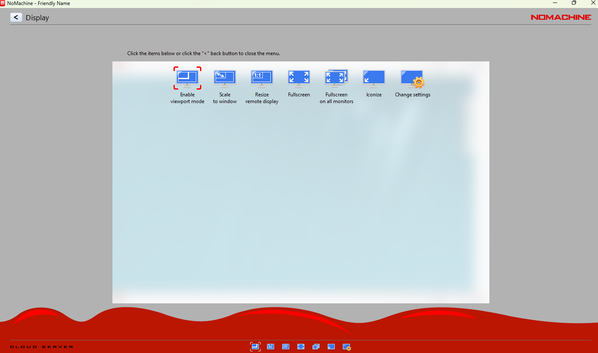{width="4.724409448818897in" height="3.0219542869641294in"}


<!---

## Browser access{#browser_access}

> Use a browser (recommended Chrome, Firefox, Opera or Safari) and go to
>
> [https://bplimexterno.bportugal.pt:4443](https://bplimexterno.bportugal.pt:4443)

Below are the sequential screens you should see. In steps 4 to 7, you can define your settings.

> {width="4.724409448818897in"
> height="3.26626968503937in"}

> {width="4.724409448818897in"
> height="3.26626968503937in"}

> {width="4.724409448818897in"
> height="3.26626968503937in"}

> {width="4.724409448818897in"
> height="3.26626968503937in"}

> {width="4.724409448818897in"
> height="3.26626968503937in"}

> {width="4.724409448818897in"
> height="3.26626968503937in"}

> {width="4.724409448818897in"
> height="3.26626968503937in"}


Configuring browser access

> To a large extent the configuration of the access via browser is
> similar to the configuration through the client NoMachine. However,
> the features and performance are lower than the "NoMachine client
> access".
>
> In case you are using a Portuguese Keyboard, note that the keyboard
> has to be set to Portuguese, as shown below, and even then some
> characters may have to be specified on the virtual keyboard (depending
> on the browser used). Please confirm the configuration of the characters
> on your keyboard.
>
> {width="4.724409448818897in"
> height="3.26626968503937in"}
>
> {width="4.724409448818897in"
> height="3.8038615485564304in"}
>
> {width="4.724409448818897in"
> height="3.779623797025372in"}
>
> 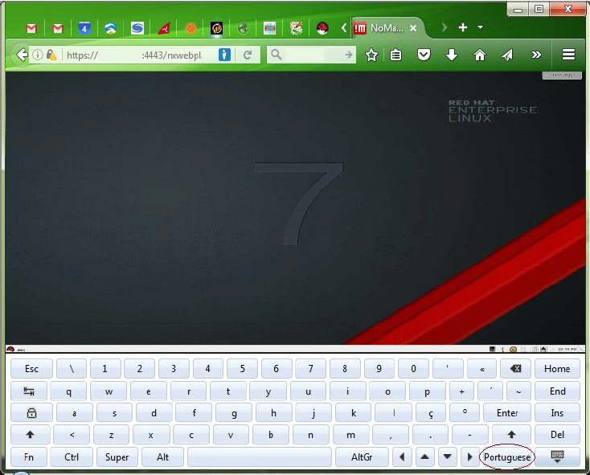{width="4.724409448818897in"
> height="3.8038615485564304in"}

-->

\newpage

## Frequently Asked Questions

<!---
1.  After the login in "https://webfa.bportugal.pt" I am not able to
    download NoMachine's setup file

 It may occur that a firewall is preventing the download. We have
 verified such problems in some Universities and Governmental services.
 Please try the download outside the firewall.
-->

1.  Mac users are not able to install NoMachine, receiving the following message:

> {width="2.1653543307086616in" height="1.4969652230971129in"}

 Please check if your Mac OSX is updated. Temporary solution: download  NoMachine Enterprise Client from the official website, and run the installation file:

> https://www.nomachine.com/download-enterprise\#NoMachine-Enterprise-Client

**\
**

2.  NoMachine authentication failure

>

> {width="4.724409448818897in" height="3.0219542869641294in"}

>

<!---
  - We have observed that some users who change their password within
    "https://webfa.bportugal.pt" later are not able to login within
    NoMachine (error message shown in the image above).
    -->
  - In some cases, it occurs due to a different keyboard layout. For example, if you have
    a Portuguese keyboard, but the website assumes a US keyboard, and
    your password contains a symbol like 'ç' then you will get a "wrong
    password" message. Please check the keyboard layout that is active
    when you type the password. Alternatively, change the password after
    the first login with NoMachine. Use linux's command 'passwd'.

>

  - Login fails, and the system shows the message: \"Could not connect to
    the server. Error is 138: Connection is timed out\" Please check if
    your network has a strict firewall; e.g., some researchers are not
    able to reach BPLIM's server within their University network. Please
    check if in a different location, like at home, the connection
    works.

**\
**

3.  User pressed 'Lock' instead of 'Log out' and the unlock/password
    does not work:

  - Check if the keyboard settings are correct (e.g., PT or UK)

  - Close the 'NoMachine' connection and start a new one. Before the
        last step -before the \'Login'- right-click and choose 'Logout'.
        Double-click for the new connection

**\
**

4.  "Cannot see the screen in NoMachine" (see image below)

>

> {width="4.016666666666667in" height="2.4999496937882766in"}

**\
**

- [OPTION A]{.underline}: move your mouse on top the upper right corner of NoMachine, you should see a "folded like sheet", left-click your mouse, go to 'Display', 'Change settings', and click in 'Disable client side hardware decoding'.

>

> {width="1.5652176290463693in" height="0.15in"}

**\
**

- [OPTION B]{.underline}: Close the 'NoMachine' connection and start a
    new one. Before the last step -before the \'Login'- right click and
    choose 'Logout'. Double-click for the new connection

\newpage

5.  "Error: Parameter 'agentm_display' has bad value" (see image below)

> {width="4.016666666666667in" height="2.4999496937882766in"}

>

  - Your home folder is full (/home/USER_LOGIN): **_Do not save files in your home folder_**

  - Ask BPLIM Staff to empty space in your home folder

**\
**

6. Session is frozen

  - Go to NoMachine first screen and double-click in the following icon

> {width="3in"}

  - right-click on the icon below and choose "Terminar sessão" 

> {width="3in"}

**\
**

7. Visualizing \LaTeX  tables

  - In case you want to see the pdf of tables you have exported to \LaTeX  you can create a generic tex file, `main.tex`, with the following content:

  > `\documentclass{article}`
  >
  > `\begin{document}`
  >
  > `\input{your_table.tex}`
  >
  > `\end{document}`

  > where your table is 'your_table.tex'. The tex file can be compiled in the Terminal by typing
  > `pdflatex main.tex`.
  

## Version control

The server runs [GitLab](https://about.gitlab.com/). If you need to use Git for your projects, please send your request to BPLIM (bplim@bportugal.pt).

In case you want to use Git you should request it from BPLIM (bplim@bportugal.pt).
  
  > [Wikipedia](https://en.wikipedia.org/wiki/Git):
  > 
  > ``Git is a distributed version-control system for tracking changes in any set of files, originally designed for coordinating work among programmers cooperating on source code during software development. Its goals include speed, data integrity, and support for distributed, non-linear workflows''

>

First steps

>

1.	First, authenticate using an `ssh-key`. Open a **Terminal** in your home folder

>

  ```
    cd ~
  ```

>

> and type:

>

  ```
    ssh-keygen -t rsa -C "BPLIM git"
    cat ~/.ssh/id_rsa.pub
  ```
>

2. Second, after generating your SSH key, you'll need to select the text of the key in your terminal. You can usually do this by clicking and dragging your mouse over the key text. Once the key is highlighted, right-click on the selection and choose 'Copy' to copy the resulting key to your clipboard.

>

3. Third, open **Firefox** (go to the RedHat icon and type Firefox in the search box) and navigate to [https://vxpp-bplimgit.bplim.local/](https://vxpp-bplimgit.bplim.local/)

>

> {width="3in"}

>

> Once you've navigated to the website, use your credentials for the external server to log in.

>

4. Once logged in, navigate to your profile. In the upper-right corner of the webpage, you will find the **Settings** option.

>

> {width="1in"}

>

> Now, on the left-side bar, click in **SSH Keys**

>

> {width="1in"}

>

> and paste the contents of the clipboard in the text box on the top right corner under **Key**.

>

> {width="3in"}

>

Give a title, e.g., "BPLIM git", and click in **Add key**.

>

5. Go to **Projects**

>

> {width="2in"}

>

and create a **New project**, e.g., `scripts_P999`, where P999 is your_project_ID_number

>

> 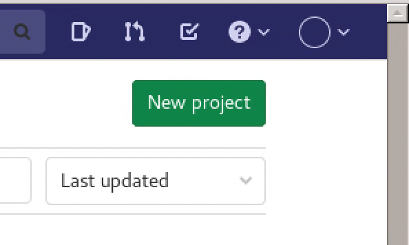{width="1in"}

>

To use git, it is necessary to modify or create the .gitconfig file in your user's home directory. You can use **KWrite** (click in the RedHat icon and search for KWrite) to edit/create the file. The file should have the following format. In this file, you can adapt the name and replace 'investa' with your own user.

>

```
  [cola]
          spellcheck = false  
  [user]
          name = Investigador A
          email = investa@sxpe-bplim01.bplim.local
  [gui]
          editor = kwrite
```

\newpage

6. You can clone the project by opening a **Terminal** and moving to your work_area:

>

```
  cd /bplimext/projects/your_project_ID/work_area/
```
>

> and typing

>

```
  git clone git@vxpp-bplimgit.bplim.local:investa/scripts_P999.git
```

>

7. Add the file `.gitignore` available in folder `tools` of your project:

>

```
  cd scripts_P999
  cp /bplimext/projects/your_project_ID/tools/.gitignore .
```

>

8. Do your first commit & push

>

```
  git add *

  git commit -a -m "First"

  git push
```

>

9. **To use the version control system effectively, please place all your scripts and code files in the folder named 'scripts_P999'. This organization is important for maintaining a structured and efficient workflow with the version control system.**

<!--- 1. move to a specific folder; _e.g._, `cd /bplimext/projects/your_project_ID/work_area/`
2. create a .gitignore file (check [toptal](https://www.toptal.com/developers/gitignore) for some examples)
3. `git init`
4. `git add *.do`
5. `git commit -a -m "First"`
6. `git show first_do_file.do`
-->

\newpage

## Containers

<!---
## Singularity containers

### Using a prebuilt image available at BPLIM's server

You can use Singularity to run the Anaconda environment inside the server. The image for Singularity is placed in:

  > `/opt/bplimext/singularity-images`

Explore the following example. Type these sequence of commands:

`cd /bplimext/projects/your_project_ID/work_area`

`mkdir containers`

`cd containers`

`singularity build --sandbox Anaconda /opt/bplimext/singularity-images/bplimAnaconda.sif`

`singularity shell --writable Anaconda`

Now you are inside the container and can run commands such as:

  > `anaconda-navigator`
  >
  > `jupyter lab`
  >
  > `spyder`

-->

### Build your container

- You can write a script to build your container using the template definition files available at our [GitHub repository](https://github.com/BPLIM/Containers)

- Test your script and build the container using [SylabsCloud](https://cloud.sylabs.io/) (you can use your GitHub account to login)

- Click in 'CREATE'

>

> {width="1.2in"}

>

- In the following step upload your '.def' file or copy/paste its contents in the Text box:

>

> {width="1.7in"}

>

- Sylabs runs a first test on the validity of your script and releases the button 'Build' (click on it)

- Follow the outcome at the bottom of the screen and check for possible error messages

- Once you succeed in building the container, you can send us the definition file with your changes

### Use the container in BPLIM's server

>

- Open a `Terminal`

- Move to your project's folder

> `cd /bplimext/projects/YOURPROJECTID/tools/containers`

- Start the container by typing

> `singularity shell YOURPROJECTID.sif`

- The prompt of the `Terminal` will show: `Singularity`

- Start RStudio by typping `rstudio` (small caps)

>

> {width="1.7in"}

>

- Once inside RStudio you have access to the original folder structure of your project.

>

## Jupyter Lab

Explore [Jupyter lab](https://jupyter.org/):

>

  > "JupyterLab is a web-based interactive development environment for Jupyter notebooks, code, and data. JupyterLab is flexible: configure and arrange the user interface to support a wide range of workflows in data science, scientific computing, and machine learning. JupyterLab is extensible and modular: write plugins that add new components and integrate with existing ones."

>

Start Jupyter Lab by typing:

>

> `jupyter lab --browser=firefox`

>

Sample session:

>

> 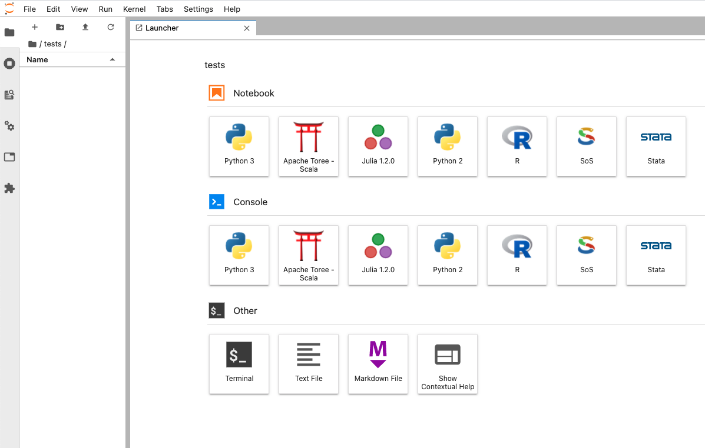{width=65%}

>

[^1]: Dolphin is an intuitive and easy-to-use file manager. You can use it, for example, to browse the directory, to
    create or delete files/directories (by using the right mouse
    button). For more information about Dolphin, please visit:
    [https://userbase.kde.org/Dolphin](https://userbase.kde.org/Dolphin)
    .

[^2]: In case 'xstata17mp.sh' does not launch Stata please see '[Section 3](#statistical_software)'.

[^3]: Click on the cross button at the upper right corner to close.

[^4]: Note that before exiting the server, you need to make
    sure that all active programs have been closed (unless they have
    been launched in *batch* mode). Running programs in *batch* mode is justified for
    procedures that require high computational resources, intense
    calculation and/or long processing time.

[^5]: The '*shell'* supports the commands in Linux operating system
    (some are disabled).

[^6]: The version of Stata on the server has the same features as the
    Stata on Windows or Mac. By default when the Stata starts in this
    way the \"working directory\" active becomes your folder
    \"work\_area\".

[^7]: You may only remove text files that do not contain data or results
    that allow identification. For all the graphs you request as an
    output you must provide the corresponding Table to replicate it. You
    may only export graphs in .PNG format (no vector graph is allowed).

[^8]: Singularity is now called [Apptainer](https://apptainer.org). You can find further information here: [https://apptainer.org](https://apptainer.org).