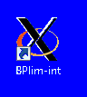
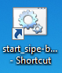
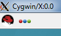
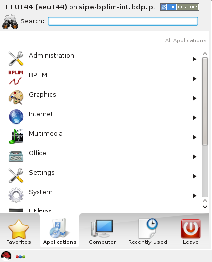
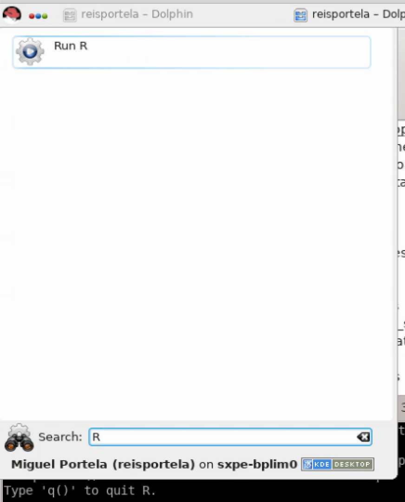

<!---

# A. From Markdown to PDF

1. open TERMINAL
2. G:
3. cd "G:\BPLIM\02. Docs Internos\03. Manuais\External Server\"
4. RUN THE FOLLOWING LINE IN THE TERMINAL

> MAC > /Users/zxc/Documents/GitHub/Manuals/InternalServer

> Gab. 1.19 > C:\Users\sws.EEG\Documents\Manuals\ExternalServer

> ACREM > C:\Users\krt\Documents\GitHub\Projects\Internal_Server\manual>

pandoc --toc --number-sections Internal_Server_Manual.md --pdf-engine=xelatex -o Internal_Server_Manual.pdf

--- OLD: pandoc -V geometry:"paperwidth=210mm,paperheight=297mm,left=27mm,right=27mm,top=27mm,bottom=27mm" External_Server_Manual.md --pdf-engine=xelatex -o External_Server_Manual.pdf ---

ALTERNATIVE

https://marketplace.visualstudio.com/items?itemName=yzane.markdown-pdf

-->

<!--=========================================== --->

# Access to the Internal Server

> Upon access approval, a user will be able to connect to the Internal
> Server through remote desktop connection, which is installed on the
> desktop with a shortcut icon "**bplim-int**". One can also obtain
> direct access to the project folder under "**pxxx\_name**", where
> "name" is the name of the user(s).

1. To access the server, click on the shortcut "**bplim-int**", then enter the password.[^1]

> {width="0.5905511811023622in"
height="0.6568372703412073in"} or
{width="0.5905511811023622in"
height="0.6952045056867892in"}

2. Select the "**Kickoff Application Launcher**" menu (in the lower, or upper, left corner):

> {width="0.5905511811023622in"
height="0.34974628171478567in"}

> {width="1.8675590551181103in"
height="2.3054680664916885in"}

3. Then you should:

> a. Click on the "**Applications**" button

> b. Select **"BPLIM"** and click on your project (*i.e.*, "pxxx\_name"). At this stage, you should see a graphical environment (Dolphin application[^2]) like this:

> {width="3.6147419072615925in"
height="2.2604166666666665in"}

> You can see the command prompt line using the keyboard shortcut
> 'F4'.

> {width="4.724409448818897in"
height="2.1755741469816274in"}

> c. Files with the \"**sh**\" extension allow you to send
    commands to your operating system or to enter your operating
    system for interactive use (for example, the file *xstata16mp.sh*
    will launch the graphical version of Stata 16). You can start the
    application by double-clicking
    the file name in 'Dolphin'[^8] or by typing in the Terminal `xstata16mp.sh`.

4. Move to the project's folder "`cd /bplim/projects/pxxx_name`" using the Terminal. The directories that you have access to within the folder include:

+-----------------------------------+-----------------------------------+
| **initial\_dataset**              |                                   |
|                                   | Data sources provided by BPLIM.   |
|                                   |                                   |
|                                   | *You have                         |
|                                   | read-only access to this          |
|                                   | directory.*                       |
+-----------------------------------+-----------------------------------+
| **results**                       |                                   |
|                                   | Output files that                 |
|                                   | researchers wish to generate      |
|                                   | and extract from the server.      |
|                                   |                                   |
|                                   | *You                              |
|                                   | have read-write access to this    |
|                                   | directory.*                       |
+-----------------------------------+-----------------------------------+
| **tools**                         |                                   |
|                                   | Specific analysis tools.          |
|                                   |                                   |
|                                   | *You have read-only access to     |
|                                   | this directory.*                  |
+-----------------------------------+-----------------------------------+
| **work\_area**                    |                                   |
|                                   | Temporary                         |
|                                   | work directory.                   |
|                                   |                                   |
|                                   | *You have read-write              |
|                                   | access to this directory.*        |
+-----------------------------------+-----------------------------------+
| **/bplim/doc/Manuals**            | Manuals and auxiliary files       |
|                                   | are available here.               |
+-----------------------------------+-----------------------------------+

  - You will have in your **work\_area** folder templates for both Stata and R. By default the template file is read only.

5.  To reset and disconnect the remote desktop connection or session,
    you can simply log out your remote session, as shown on the
    screenshot below. After you log out*,* close the window.[^3]

> {width="2.2190409011373577in"
height="2.7559055118110236in"}

Confirm before exiting by clicking on the **\"Exit\"** button to close the window[^4]

> {width="2.61462489063867in"
height="1.5748031496062993in"}.

# Important guidelines

## Keep your home area tidy

 - _Do not save files in your home area_ `/home/USER_LOGIN`. _In case you exceed its size you will not be able to log in._

 - Check regularly the size of your project in the harddrive. Open a Terminal and apply the following steps:

  1. Move to the project folder: `cd /bplim/projects/p000_xxx_yyy/`
  2. List project size: `du -h`
  3. Check size by folder and list folders with at least 1Gb: `du --max-depth 1 -h | sort -n | grep G`
  4. Move to the folder 'work_area': `cd work_area`
  5. Repeat the check in this folder: `du --max-depth 1 -h | sort -n | grep G`
  6. Identify duplicated and temporary files and delete them: use the command `rm`
  7. Compress big files/folders you are not using at the moment:
  
  > Compress folders: `tar -zcvf YOUR_FOLDER.tar.gz YOUR_FOLDER`
  >
  > Compress individual files: `gzip YOUR_FILE`

## Using the Terminal

Linux's Terminal is a command-line interpreter. You can use the 'shell' for a wide range of tasks, including searching files and files' contents, organizing your working space, and, most importantly, run your programs in `batch` mode.

1.  Linux's Terminal can be accessed from[^5]

RedHat \> Applications \> System \> Terminal

{width="3.937007874015748in"
height="1.848682195975503in"}

2.  See [Section 8.1](#shell_commands) for a list of some of the most used commands.

3. In case you are using a non-English keyboard, the 'true' keyboard
    might be different from the one you see. The changes apply mostly
    to the symbols, not letters or numbers. For example, in case you
    have a Portuguese keyboard on your computer the '+' is now in key
    '?', or the '\*' is in SHIFT + ?. This issue is specific to the
    Operating System of your computer

4. Remember that Linux is case-sensitive: e.g., "`LS`" and "`ls`" are
    treated as different commands.

5. You can use the arrow keys to scroll up and down through the
    commands you have entered.

6. You can use the "Tab" key to complete the command line
    automatically.

7. _e.g._, type the following line to list elements within a folder in a 'human-readable' format, `h`, long list format, `l`, in reverse order,
    `r`, sort by modification time, `t`, and almost all files, `A`,

    `ls -lArth`

# Statistical software{#statistical_software}

## Stata

Stata versions available in the server: 14, 15, 16 and 17 (adjust the following lines to the Stata version you want to use)

1. Stata can be accessed in interactive graphical or non-graphical
        modes.[^6]

  - Interactive non-graphical mode

    Move to the desired folder, e.g.,

      `cd /bplim/projects/I001_jdoe/`

    and type

      `/opt/bplim/stata16/stata-mp`

{width="3.543307086614173in"
height="2.488604549431321in"}

  - You may add a 'PATH' to your system folder by typing, for the
    example on Stata 16, the following command in the shell "vi ~/.bash_profile" and adapt the following line
    
    `PATH=$PATH:$HOME/.local/bin:$HOME/bin:/opt/bplim/stata16`

  - For the interactive graphical mode click on the icons
    "**xstata16mp.sh**" (Stata 16) located in the
    'desktop', depending on the desired Stata version,

{width="0.5905511811023622in"
height="0.46653543307086615in"}

{width="3.937007874015748in"
height="2.486382327209099in"}

  - You can use the 'Do-file Editor' in Stata to create your own
      "do-files" and "ado-files", or you can use
      *KWrite* editor (or 'gedit')

  - You can open it from **RedHat** \> **Applications**
      \> **Utilities** \> **KWrite**. You can also launch 'KWrite' from the 'shell' by typing 'kwrite'

  - In case the icon is not in your desktop, use Dolphin, move to folder
    '/bplim/scripts/wrappers/', and drag and drop the file 'xstata-mp' corresponding to the Stata version you want into
    the desktop

2. To look for **"ado-files"**:

"Ado-files" are text files containing the Stata program. It is
advisable that one create and save his/her "ado-files" so the results
can be replicated later by running the saved "ado-files" on the
BPLIM's datasets.

Stata looks for "ado-files" in several places. When it comes to
personal ado-directories, they can be categorized in four ways:

  - (SITE), the directory for "ado-files" your site might have
    installed;

  - (PLUS), the directory for "ado-files" you might have
    installed;

  - (PERSONAL), the directory for "ado-files" you might have written;

  - (OLDPLACE), the directory where Stata users used to save their
    personally written ado-files.

The ado-files you have just written or those created for this project
can be found in the current directory (.).

 Specific 'ado-files' you may ask to be made available in the server
 will be placed in your folder
 '/bplim/projects/YOURPROJECTID/tools'. You should add this folder
 to your Stata 'ado-files' folder by executing the following command
 within Stata,

  `sysdir set PERSONAL "/bplim/projects/YOURPROJECTID/tools"`

 You may also edit your 'profile.do' file, located in your root folder,
 "/home/YOURPROJECTID/", and add key instructions you may want to be
 executed every time you start Stata. The above instruction is one of
 such cases. You can create, or edit, the file 'profile.do' using
 'Do-file Editor' within Stata ('vi profile.do' or KWrite are also a
 possibility).

 The ***sysdir*** command within Stata will tell you where they are on
 your computer:

{width="3.9368055555555554in"
height="2.2751399825021874in"}

## 'batch' mode: an example using Stata

1.  Start a *\'**shell**\'* in Linux and navigate to the directory
         of the "do-file" file that you want to run (ex: prog1.do)

 `cd /bplim/projects/I001_jdoe/work_area/`

2. You might find it easier to use 'Dolphin' (= File Manager) to move
     over your folder structure. In this case, we recommend activating
     the 'shell' (= 'Terminal') associated with 'Dolphin'

  -  use Dolphin/File Manager

  - click 'F4' to activate the shell with Dolphin. Benefit: fast
         transition within folders and, at the same time, the ability
         to run shell commands

3. Create an ASCII file named, e.g., 'batch\_prog1'

4. Inside the file write just a line with the execution command you
     would type in the 'shell'; e.g.,

    `/opt/bplim/stata16/stata-mp do`
    
    `/bplim/projects/I001_jdoe/work_area/prog1.do`

5. You can use, for example, the command line app 'vi' to create the batch file

{width="3.543307086614173in"
height="0.8180216535433071in"}

6. The batch file can also be created using apps like 'kwrite' or Stata
     'do file editor'

{width="3.543307086614173in"
height="1.1132370953630797in"}

or

{width="3.543307086614173in"
height="2.0134241032370954in"}

7. You may add the extension '.txt' to the name of the batch file, as
     sometimes Stata *doeditor* does not 'see' the file 'batch', while
     it 'sees' 'batch.txt'

8. Once the batch file is created one runs the .do file in batch mode
     by typing in the 'Terminal':

    `at now -f batch.txt`

9. Type 'man at' to see a further option of the command '`at`'; e.g., one
     could type

    `at now + 5 hours -f batch.txt`

  or

    `at now + 4 minutes -f batch_prog1`

  to run the Stata program within 5 hours or 4 minutes from now,
  respectively. '`man`' is the help function in Linux

10. Type '`top`' in the shell/Terminal to confirm the program is running

11. Under '`top`' type '`i`' to hide irrelevant processes (show less output)

12. To kill a running process with '`top`' press '`k`', for '`kill`', write
    > the process number and then type '`9`'. The process number is
    > identified in the first column as PID

13. To get out of the top, type '`q`'

14. Useful features of the command '`at`':

  - '`atq`': use it to see programs in the batch queue (an '`=`' sign
         indicates the program is running; an '`a`' indicates it is in
         the queue and we see the time when it will be executed)

  - '`atrm` \#': remove a batch from the batch queue

  - one can see how the batch is running by typing

      `tail --f logcrc_may21.log`

 It allows you to see an updated version of the last lines of the log;
 *i.e.*, it updates each time the log is changed by Stata. A key
 advantage of tail is that it does not interfere with the log file,
 namely, it does not write over it.

15. Another way to run a program in the background is by using the
     command '`screen`'

  - '`screen`' is useful when one wants to run Stata in interactive
         mode and still guarantee that if the network connection goes
         down one does not lose the session. We can simply kill the
         'NoMachine' session and recover it later by typing '`screen --r`'

  - We can run several instances of screen. If this is the case,
         after opening a new NoMachine session we need to type in the
         Terminal shell '`screen -d`' to identify the running background
         sessions. We can retrieve a particular session by knowing the
         '`pid`' number and typing '`screen -r 34176`'

## R

1. As with Stata, R can be accessed in interactive graphical or non-graphical modes.

  - Interactive non-graphical mode: go the RedHat symbol and type `R' in the Search box

{width=50%}
    
  - Alternatively, you can open a Terminal and type

> `R`

  - Please make sure R is in your PATH; type `$PATH` in the Terminal. If this is not the case, type `PATH=$PATH:/usr/bin/`

2. Using RStudio.

  - Open a Terminal and type 
  
  > `rstudio`

  - Please make sure RStudio is in your PATH; type $PATH in the Terminal. If this is not the case, type
  
  > `PATH=$PATH:/opt/bplim/R/usr/lib64/rstudio/bin/`

## Python

1. Open a Terminal and type

> `python3`

## Julia

1. Open a Terminal and type (julia is located in /opt/bplim/julia/lib/, you can add it to your `PATH`)

> `julia`

2. Use Atom: open a Terminal and type

> `atom`

## Updates to the commands and packages list

  Additional commands/packages or updates to the existing ones have to be requested to BPLIM's Team.

# Allowed outputs

Stata results can be extracted to a file on disk using one of the following formats:

1. ASCII files: e.g., log files

2. graphs: as .PNG

3. csv: CSV (Comma Separated Value format), e.g., for use with MS Excel

4. rtf: Rich Text Format for use with word processors

5. xls or xlsx: Excel files with output tables

6. tex: Latex format

# Remove outputs

Place in the "results" folder all the outputs you want
to remove from the server.[^7]

1. Send an email with the title
    "**project p001\_jdoe**: request for result extraction" to
    "**bplim\@bportugal**".

2. Upon validation, the results will be sent to you via email.

# User's Home folder

1. Do not save files in your Home folder:
    "/home/USER_ID/".

2. Regularly clean your Trash folder. If your disk use goes over the quota you will be prevented to login. In the Terminal type:
    
    `rm -rf ~/.local/share/Trash/*`

# Scientific Support

Researchers will be provided with the necessary scientific and
computational support (*i.e.*, advises on programming, computational
resources, micro econometrics, and econometrics of panel data for
research undertaken with the selected microdata).

# Appendix

## Basic 'shell' commands on Linux{#shell_commands}

-   `top`: List the procedures that are being executed on the
    server

    -   press '`i`' option to omit background processes;

    -   clicar press '`h`' para ***help on top options*** ; '`h`'
        > option to obtain the **top command help**.

-   `pwd`: Show current working
    directory

-   `cd`: Change directory

    `cd /bplim/projects/I001_jdoe/work_area/`

    '`cd ~`' moves to your home folder

<!-- -->

-   `cp`: Copy file(s) to a given path

    `cp prog1.do /bplim/projects/I001_jdoe/results`

<!-- -->

-   `mv`: Move file(s) or rename a file from a given path

    `mv prog1.do /bplim/projects/I001_jdoe/results`

<!-- -->

-   `rm`: Delete a file

    `rm /bplim/projects/I001_jdoe/results/prog1.do`

<!-- -->

-   `mkdir`: Creates a directory

    `mkdir programs`

<!-- -->

-   `rmdir`: Deletes a directory

    `rmdir programs`

<!-- -->

-   `screen`: Switch between screen

    `screen top`

<!-- -->

-   `man`: Show the manual page for the given command

    `man ls`

<!-- -->

-   `du -h`: Check the information of disk usage of files and
    directories.

> The "`-h`" option with "`du`" command provides results in "Human
> Readable Format".

Ex: `du /bplim/projects/I001_jdoe/work_area/`

-   `df -h`: Check disk space utilization and show the disk space
    > statistics in "human readable" format.

-   `vi`: View 'ASCII' files; e.g., log files

-   `ghostscript`: Preview files with the extensions of _.eps_ and
    _.pdf_

> `ghostscript /bplim/projects/I001_jdoe/results/file_name.pdf`

-   `okular`: View 'PDF'

-   `find`: Find files

> Structure: find /path option filename
>
> `find . -name "*.do"`
>
> Send the '`find`' output to a file:
>
> `find . -name "\*.do" > find_results.txt`
>
> Look for a particular string within the 'find' output:
>
> `find . -name "\*.do" | grep "analysis"`
>
> Identify files with extension '.do' that **contain** the word 'graph':
>
> `find . -name "\*.do" -exec grep "graph export" '{}' \; -print`

-   `passwd`: Change your password

-   **To exit** a program, type **CTRL + C** ('CTRL + C' kills a particular
    execution in the shell)

## Using the 'vi' file editor

1.  In the shell type '`vi batch1.txt`'

2.  These are the main shortcut keys

    a.  'i' insert text

    b.  'ESC' key get out of the 'insert' mode

    c.  'x' delete specific characters

    d.  'dd' delete a full line

    e.  '10 dd' delete 10 lines

    f.  'yy' copy lines

    g.  'p' paste lines

    h.  'SHIFT + G' go to the last line

    i.  'gg' goes to the first line

    j.  'ESC + q!' exit 'vi' without writing

    k.  'w!' write and replace the file

    l.  'ESC + q' exit the 'vi' session

    m.  Check, for example,
        [https://www.cs.colostate.edu/helpdocs/vi.html](https://www.cs.colostate.edu/helpdocs/vi.html)

3.  Much easier solution: call '`gedit`' file editor

4.  Linux commands I have to add to the manual

5.  'CTRL + R': allows me to recover a previous command

6.  `vi .bash_history`

## Add information to the PATH

1. Open a Terminal
2. Type 'vi .bashrc'
3. Press 'i'
4. Add the following line at the end of the script:

> export PATH=$PATH:/opt/bplim/stata16/:
> /opt/bplim/R/bin/:/opt/bplim/R/usr/lib64/rstudio/bin/
> :/opt/bplim/julia/bin/:/opt/bplim/R/

5. You can now run, for example, R by typing in the Terminal 'R'
6. Likewise for 'julia', 'stata-mp', 'xstata-mp', 'rstudio' or 'python'

## Frequently Asked Questions

1. Visualizing \LaTeX  tables

  - In case you want to see the pdf of tables you have exported to \LaTeX  you can create a generic tex file, `main.tex`, with the following content:

  > `\documentclass{article}`
  >
  > `\begin{document}`
  >
  > `\input{your_table.tex}`
  >
  > `\end{document}`

  > where your table is 'your_table.tex'. The tex file can be compiled in the Terminal typing
  > `pdflatex main.tex`.
  
## Git

You can use version-control. The server runs [Git](https://git-scm.com/) version 1.8.3.1. 
  
  > [Wikipedia](https://en.wikipedia.org/wiki/Git):
  > 
  > ``Git is a distributed version-control system for tracking changes in any set of files, originally designed for coordinating work among programmers cooperating on source code during software development. Its goals include speed, data integrity, and support for distributed, non-linear workflows''

First steps

1. move to a specific folder; _e.g._, `cd /bplim/projects/your_project_ID/work_area/`
2. `git init`
3. create a .gitignore file (check [toptal](https://www.toptal.com/developers/gitignore) for some examples)
4. `git add *.do`
5. `git commit -a -m First`
6. `git show first_do_file.do`

## Singularity

You can use Singularity to run the Anaconda environment inside the server. The image for Singularity is placed in:

  > `/opt/bplim/singularity-images`

Explore the following example. Type these sequence of commands:

`cd /bplim/projects/your_project_ID/work_area`

`mkdir containers`

`cd containers`

`singularity build --sandbox Anaconda /opt/bplim/singularity-images/bplimAnaconda.sif`

`singularity shell --writable Anaconda`

Now you are inside the container and can run commands such as:

  > `anaconda-navigator`
  >
  > `jupyter lab`
  >
  > `spyder`

## Jupyter Lab

Explore [Jupyter lab](https://jupyter.org/):

  > "JupyterLab is a web-based interactive development environment for Jupyter notebooks, code, and data. JupyterLab is flexible: configure and arrange the user interface to support a wide range of workflows in data science, scientific computing, and machine learning. JupyterLab is extensible and modular: write plugins that add new components and integrate with existing ones."

Start Jupyter Lab by typing:

  > `jupyter lab`

Sample session:

{width=65%}

[^1]: The password is the same as the one that you use to access the internal network at the Banco de Portugal. External researchers accessing the data in the Internal Server will be assigned a username and password to access the project folder.

[^2]: Dolphin is an intuitive and easy-to-use file manager. You can use it, for example, to browse the directory, to
    create or to delete files/directories (by using the right mouse button). For more information about Dolphin, please visit: [https://userbase.kde.org/Dolphin](https://translate.google.com/translate?hl=en&prev=_t&sl=pt-BR&tl=en&u=https://userbase.kde.org/Dolphin)

[^3]: Click on the cross button at the upper right corner to close.

[^4]: Note that before exiting the server, you need to make
sure that all active programs have been closed (unless they have been launched in *batch* mode). Running programs in *batch* mode is justified for procedures that require high computational resources, intense calculation and / or long processing time.

[^5]: The *shell* supports the commands in Linux operating system (some are disabled).

[^6]: The version of Stata on the server has the same features as the Stata on Windows or Mac. By default when Stata starts in this way the active \"working directory\" active becomes your folder \"work\_area\".

[^7]: You may only remove text files that do not contain data or results that allow identification of individual units. For all the graphs you request as an output you must provide the corresponding Table to replicate it. You may only export graphs in .PNG format (no vector graph is allowed).

[^8]: In case 'xstata16mp.sh' does not launch Stata please see '[Section 3](#statistical_software)'.

